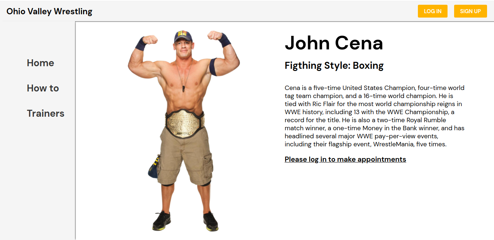

# Book an Appointment (Final Capstone)

This is the Final capstone project for the microverse course, where i have to create the back-end and the front-end of a web page, work with the better praticews learn along the course

- [Back-end repository](https://github.com/helman101/wrestling-coaches-database)

# Wrestling Trainers ~ React/Redux

A complete web page for users to make an appointment with a wrestling trainer based on the WWE wrestlers, users can:
- create an user to make appointments
- make appointments
- see their appointments

# Project Preview



## [Live Link](https://nervous-benz-f4b5b8.netlify.app/trainers)

## Built With

- JavaScript
- REACT
- REDUX
- Jest
- HTML
- CSS

## Getting Started

To set up a local copy of the project

- `git clone git@github.com:helman101/wrestling-trainers-app.git`
- `cd wrestling-trainers-app`
- `npm install`

### Run tests

- Go to your terminal
- Run ```npm test``` to run all the tests.

## Run locally

- Now you are ready to run a local server
- Go to your command line and put `npm start`
- Go to https://localhost:3000/
- Try it!!

## Author

👤 **Andres Ortegon**

- GitHub: [@helman101](https://github.com/helman101)
- Twitter: [@helman1011](https://twitter.com/Helman1011)
- LinkedIn: [Andres Ortegon](https://www.linkedin.com/in/helman101/)

## 🤝 Contributing

Contributions, issues, and feature requests are welcome!

## Show your support

Give a ⭐️ if you like this project!

## 📝 [License](LICENSE)

